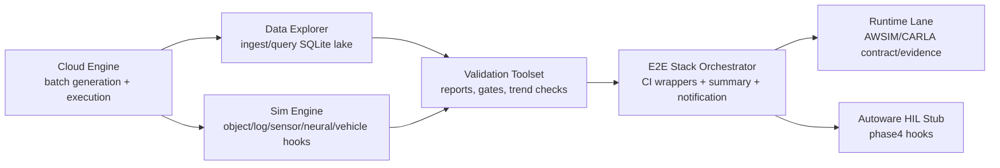

# Autonomy E2E Codebase

Clean, codebase-only repository for an Applied-style autonomous driving E2E stack.

This repo is organized to run one command pipeline flows across:
1. scenario/batch execution,
2. data ingest/query,
3. validation and release reporting,
4. runtime lane checks (AWSIM/CARLA contracts and evidence).

## Scope

Included:
- `.github/workflows/`
- `30_Projects/*/prototype/`
- root `.gitignore`

Excluded:
- knowledge/literature/doc-only content
- local logs, reports, runtime artifacts, cache DB files
- source workspace untracked files

## System Architecture



## Repository Layout

- `30_Projects/P_E2E_Stack/prototype`  
  Entry pipeline, CI wrappers, matrix/scope control, summary/notification, runtime lane orchestration.
- `30_Projects/P_Sim-Engine/prototype`  
  Core simulation stubs and hooks: object/log/sensor/neural/vehicle + runtime adapter/probe/contract runners.
- `30_Projects/P_Cloud-Engine/prototype`  
  Batch runner and scenario batch generation.
- `30_Projects/P_Data-Lake-and-Explorer/prototype`  
  Ingest/query layer and dataset manifest handling.
- `30_Projects/P_Validation-Tooling-MVP/prototype`  
  Release report generation, gate profiles, requirement maps.
- `30_Projects/P_Map-Toolset-MVP/prototype`  
  Map convert/validate/route checks.
- `30_Projects/P_Autoware-Workspace-CI-MVP/prototype`  
  HIL sequence contract stubs.
- `.github/workflows`  
  PR/Nightly/runtime-available workflows.

## Prerequisites

- macOS/Linux shell
- `python3`
- `make`
- optional: `docker` (recommended for Linux runtime lane reproduction on macOS)
- optional: `gh` for workflow dispatch and GitHub automation

## Quick Start

From repo root:

```bash
cd 30_Projects/P_E2E_Stack/prototype
make help
make pipeline-smoke RELEASE_ID=REL_LOCAL_SMOKE_001
```

Pipeline dry-run:

```bash
cd 30_Projects/P_E2E_Stack/prototype
make pipeline-dry-run RELEASE_ID=REL_LOCAL_DRYRUN_001
```

## Runtime Lane Usage (AWSIM/CARLA)

Runtime contract lane auto-select:

```bash
cd 30_Projects/P_E2E_Stack/prototype
make pipeline-runtime-available-auto \
  RELEASE_ID=REL_RUNTIME_AUTO_001 \
  RUNTIME_AVAILABLE_SIM_RUNTIME=awsim
```

macOS -> Linux container execution lane:

```bash
cd 30_Projects/P_E2E_Stack/prototype
make pipeline-runtime-available-auto-docker-linux-fast-nobuild \
  RELEASE_ID=REL_RUNTIME_DOCKER_001 \
  RUNTIME_AVAILABLE_SIM_RUNTIME=awsim \
  RUNTIME_AVAILABLE_AUTO_FORCE_LANE=exec
```

## Sensor Sim Implementation

Sensor simulation core is in:
- `30_Projects/P_Sim-Engine/prototype/sensor_sim_bridge.py`
- camera/lidar/radar plugin stubs + fidelity tiers (`contract|basic|high`)
- quality summary outputs (`sensor_quality_summary`) for phase2 aggregation

Related runtime contract runners:
- `sim_runtime_adapter_stub.py`
- `sim_runtime_probe_runner.py`
- `sim_runtime_scenario_contract_runner.py`
- `sim_runtime_scene_result_runner.py`
- `sim_runtime_interop_*_runner.py`

## CI Workflows

- `.github/workflows/e2e-pr-quick.yml`
- `.github/workflows/e2e-nightly.yml`
- `.github/workflows/e2e-runtime-available.yml`

Use local parity checks before workflow dispatch:

```bash
cd 30_Projects/P_E2E_Stack/prototype
make phase1-regression
make phase4-regression
make validate
```

## Generated Artifacts

The following are intentionally ignored by `.gitignore`:
- `**/runs/`
- `**/reports/`
- `**/batch_runs/`
- `**/*.sqlite`, `**/*.db`
- `**/*.log`

This keeps the repository clean for GitHub and prevents runtime outputs from polluting commits.
